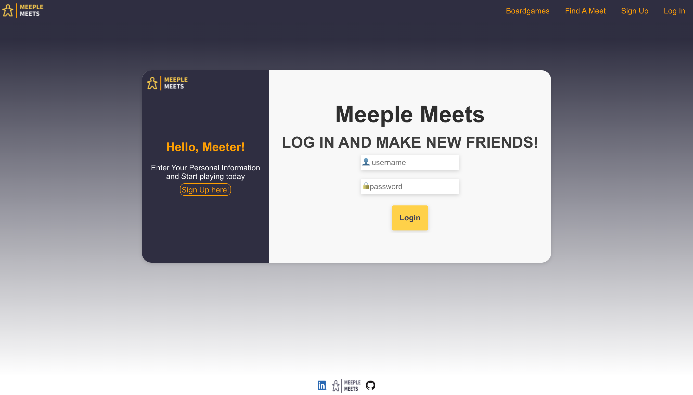
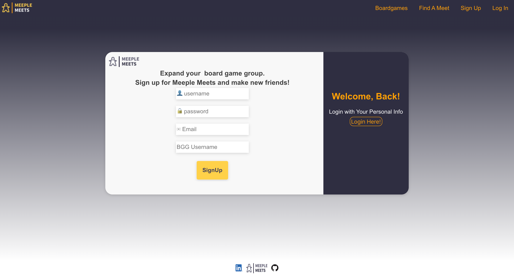
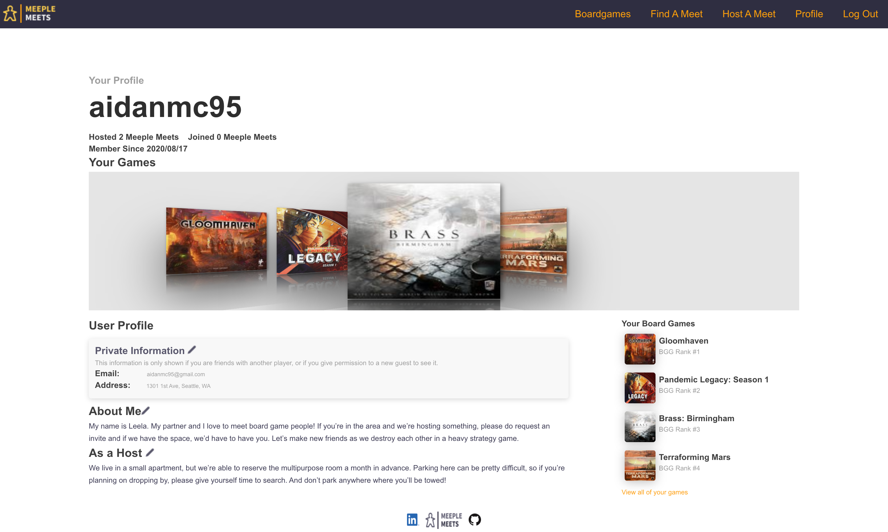
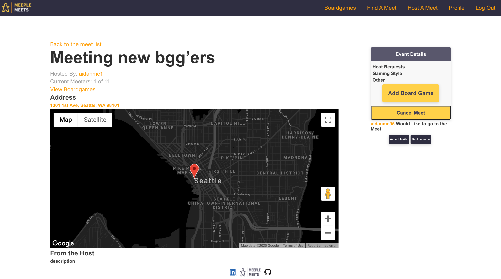
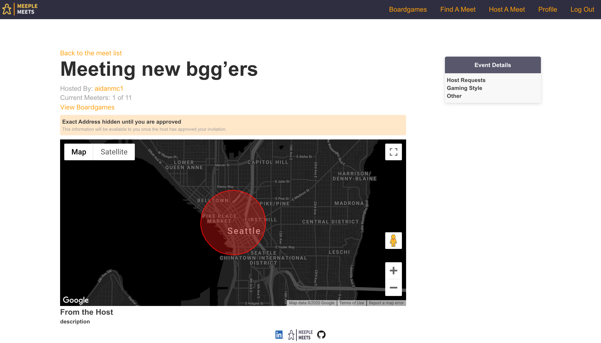
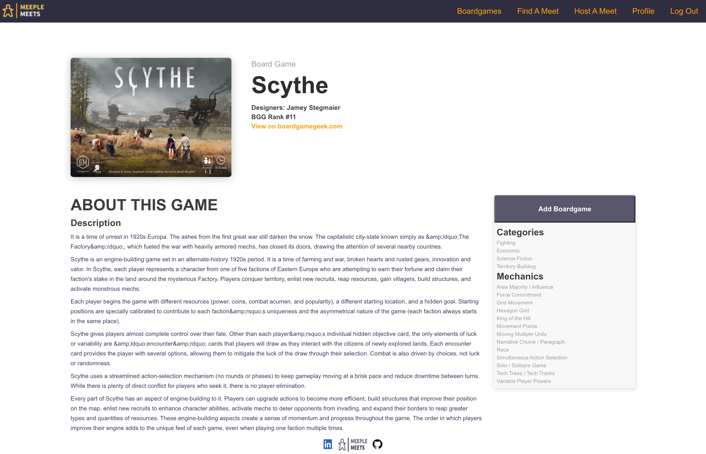

# Meeple Meets - Backend

Meeple Meets is an application that allows board gamers to connect and play together.

[This](https://github.com/aidanmc95/Meeple-Meets-Backend) is a link to the back-end repository.

## Motivation

I wanted to create an app that would allow for people to easily set up and meet new people doing an activity that they loved. There wasn't anything out there that targeted board gamers specificly so I decided to create it.

## Screenshots
Log In

Create Account

Profile Page

Meet Page Accepted/Host

Meet Page Not Accepted

Boardgame Library

Boardgame

## Technology Used

- JS
- Rails Router
- React
- Google Maps API
- BGG API

## Features

Users Can:
- Create an account
- Add Boardgames to their Library
- Join and Host Meets
- Add games to a Meet they are a part of

## Installation

Clone the front-end, and run 'npm i'. After this you will need to get a Google Maps API key and put it into a .env file (REACT_APP_GOOGLE_API_MAP_KEY = your-google-maps-api-key). You will also need to change the first two lines of the api.js file in the src/services folder back to local host, if you would like to make changes to the backend. Then run 'npm start'

Clone back-end repo and run the following commands in order: bundle install, rails db:migrate, rails db:seed, rails s -p 3001.

## Contributing

Contributions are welcome, submit a pull request!

## Authors

* **Aidan Muller-Cohn** - [GitHub](https://github.com/aidanmc95) | [LinkedIn](https://www.linkedin.com/in/aidan-muller-cohn/)

* **UX/UI - Robbin Arcega** - UX/UI Design - [LinkedIn](https://www.linkedin.com/in/robbinarcega/)

## License

This project is licensed under the [GNU GPL](https://www.gnu.org/licenses/gpl-3.0.en.html)